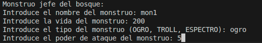
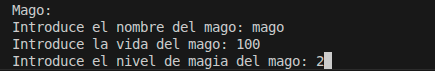
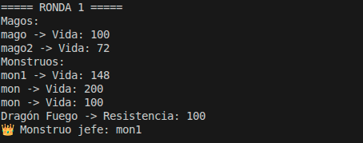
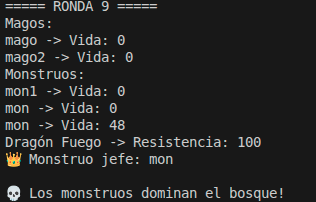

# Manual de Usuario - Dragolandia

## Descripción

**Dragolandia** es una aplicación de simulación de batallas épicas donde monstruos y magos se enfrentan a un poderoso dragón que defiende su bosque. ¡Prepárate para una batalla legendaria!

---

## Inicio de la Aplicación

Para iniciar la aplicación, simplemente ejecuta el programa principal. El sistema te guiará a través de todo el proceso de configuración de la batalla.

---

## Guía Paso a Paso

### **Paso 1: Crear los Monstruos** 

Introduce los datos de **3 monstruos** que participarán en la batalla:
- Nombre del monstruo
- Puntos de vida
- Poder de ataque
- Otros atributos necesarios

---

### **Paso 2: Crear los Magos** 

Introduce los datos de **2 magos** que liderarán el ataque:
- Nombre del mago
- Nivel de poder
- Hechizos disponibles
- Otros atributos mágicos

---

### **Paso 3: Generación del Bosque** 

La aplicación creará automáticamente:
- Un **bosque místico** como campo de batalla
- Un **dragón guardián** que defenderá su territorio y te ayudará con los monstruos

---

## Sistema de Batalla

### **Mecánica de Combate**

La batalla se desarrolla en **rondas sucesivas** donde:

1.  Cada personaje tiene su turno de ataque
2.  Se calculan daños según las estadísticas
3.  La ronda continúa hasta que un bando sea derrotado

---

### **Finalización de la Batalla** 

La batalla termina cuando:
-  Todos los monstruos y magos son derrotados

