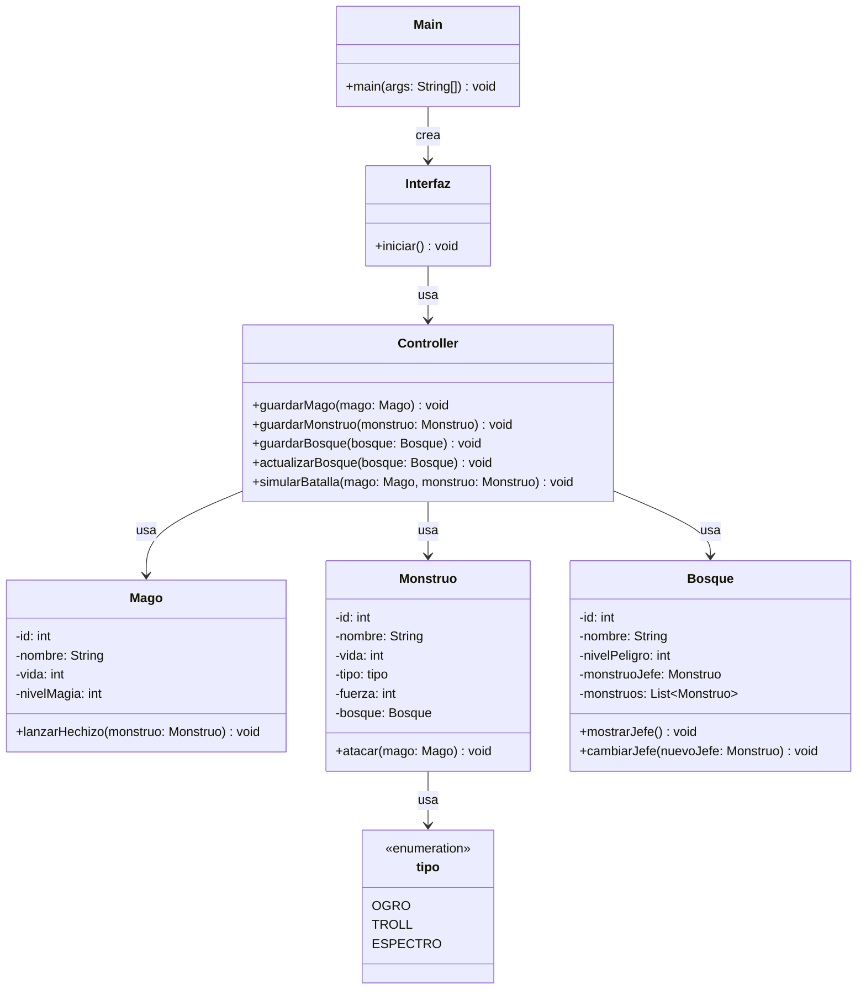
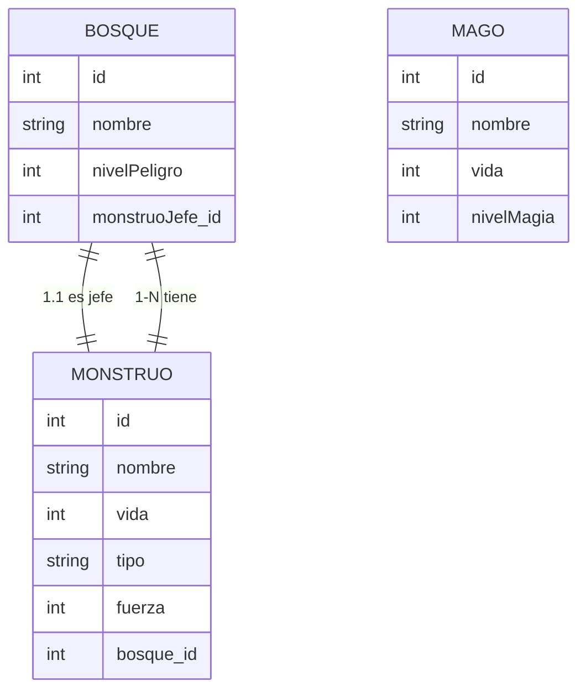

# Dragonlandia

## Introduccion

Juego de consola sencillo para simular la conquista de un bosque entre un mago y monstruos usando Hibernate y MySQL. El flujo se gestiona desde una interfaz de texto que solicita los datos por teclado y persiste entidades en la base de datos.

### Diagrama de Clases Mermaid 

### Diagrama BD Mermaid 

