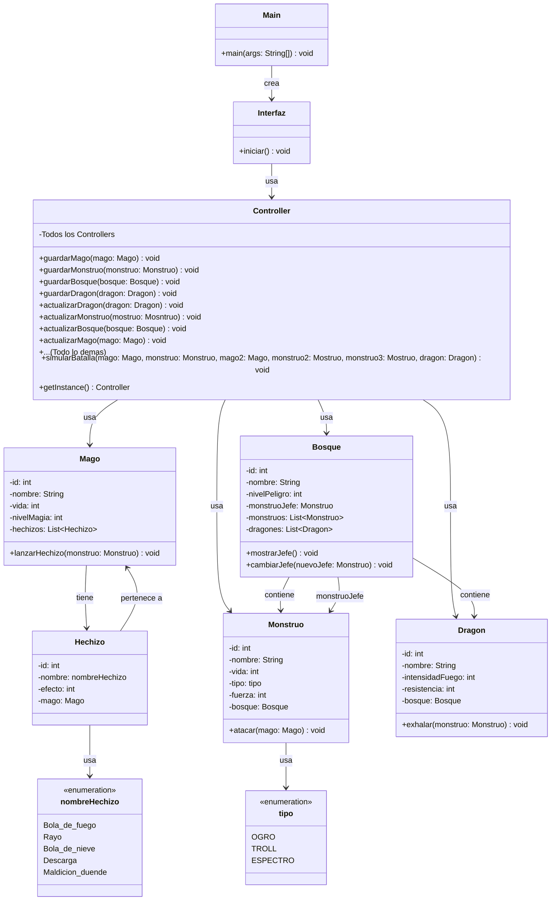
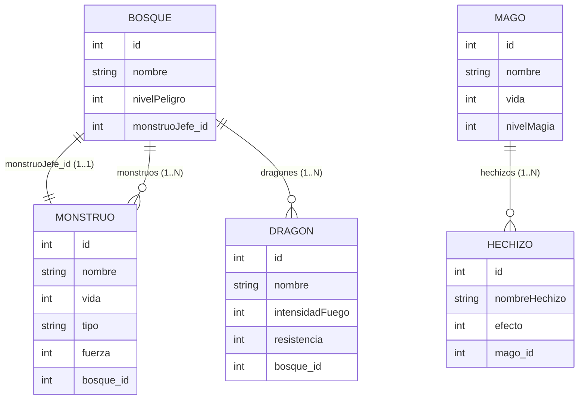

# Dragonlandia

## Introduccion

Juego de consola sencillo para simular la conquista de un bosque entre un mago y monstruos usando Hibernate y MySQL. El flujo se gestiona desde una interfaz de texto que solicita los datos por teclado y persiste entidades en la base de datos.

## Analisis

### Diagrama de Clases Mermaid 

## Diseño

### Diagrama BD Mermaid 

## Manual de Usuario

[Manual de Usuario](ManualUsuario.md)

## PFD Tablas

[PDF Tablas](AnteloRey_Fernando_DragonlandiaHibernate.pdf)